**GitPages Link:** https://omp5gsel.github.io/Just-Count/

**Kanban Board:** https://github.com/users/omp5gsel/projects/2

# Just-Count

A simple, online game, where all that you need to do is **match cards and count!**

## Overview for site requirements

This site is intended to give entertainment to players by using memory and timers to create quick competative gameplay. The site aims to provide the following mechincs & features:

-   Guided “How to Play” tutorial
-   Dynamic and random card board each round
-   30 second round timer with +3's bonus per correct match
-   10 pts for the first match with a multiplier up to 3x for consecutive correct answers.

## Development Process

### 1. Planning

I started by creating wireframes for desktop, tablet and mobile versions of the website using Balsamiq. These are included in the `/assets/images/readme/wireframes/` folder. The purpose of this is to give me chance to see how the site would be layed out, and how this needs to be created in order to be compatible, responsive, and most importantly, playable, on a wide range of devices.

### 2. Building the Site

The site will only require one page. This is because the plan is for the site to be easy to follow from the second the page is loaded and only the required content shows at the correct points of the users experience. For this, I will utilise HTML libraries such as bootstrap for a responsive and quick layout, CSS for custom aespethics, JavaScript libraries such as JQuery for interactivity and animation and Font-Awesome for icons.

### 3. Testing

I will test the site manually on multiple browsers and devices, as well as automatically using Jest to check core game mechanics are working as expected. I will use W3C validators and Lighthouse for performance and accessibility. Details are in the Testing section.

### 4. Deployment

The site is deployed to Github & Github Pages.

---

## Project Management

Tracked tasks and progress on the [GitHub Project Kanban Board](https://github.com/users/omp5gsel/projects/2).

---

## User Stories

### 1. One Off Player

**Who:** A site visitor.

**Why:** They are looking for a quick game to fill time between other activities.

**How:**

-   Visit the page.
-   Follow the tutorial on how to play the game.

    

-   Play the game until the game is over.

    

### 2. Repeat Player

**Who:** A site visitor / player.

**Why:** They are looking to beat their high score.

**How:**

-   Visit the homepage.
-   Skip the tutorial on how to play the game.
-   Play the game.
-   View score when timer is up.

    

---

## Wireframes

The website layout was planned using wireframes to ensure a user-friendly and responsive design. Below are the wireframes for desktop, tablet, and mobile views of the home page (left to right).


---

## Deployment

### 1. Download the Code

Head to the github page for this project, [here](https://github.com/omp5gsel/Just-Count), and select "Download ZIP" under the "<> Code" button.

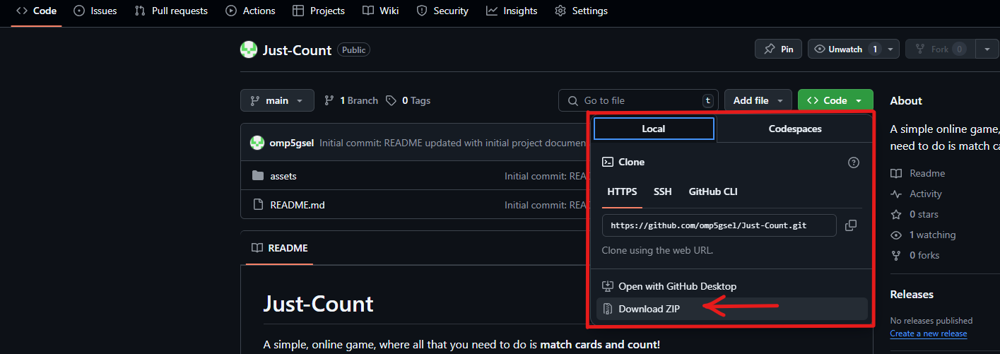

### 2. Extract the Code to a Local Folder

Locate your downloaded code, usually in C:\Users\\%username%\Downloads. Select your file, and then extract the code into a new folder using the "Extract All" button on the toolbar.

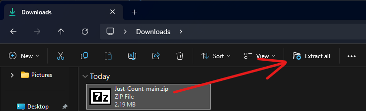

### 3. Install & Open VSCode

You can download VSCode by clicking [here](https://code.visualstudio.com/download). Once you're in VScode, please click File > Open Folder and select your extracted code root folder.

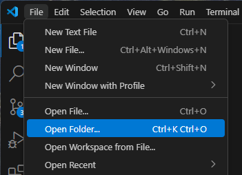

### 4. Open any page

Within the explorer pane on the left side of VScode, click onto the `index.html` file to open this in the editor.

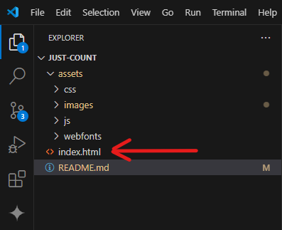

### 5. Install "Live Server"

Using the extensions pane, outlined in the image below, search and install the "Live Server" extension.

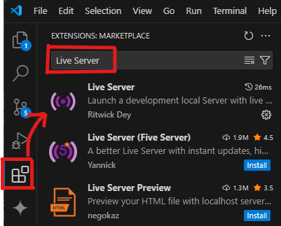

### 6. "Go Live"

Within the HTML page, press Go Live along the bottom bar

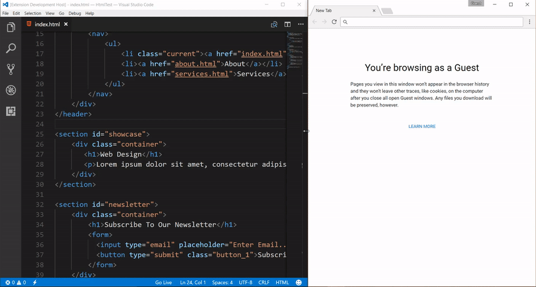

---

## Technologies Used

| Technology          | Purpose                                                |
| ------------------- | ------------------------------------------------------ |
| **HTML**            | Structures content and elements of the site.           |
| **CSS**             | Stylse the site, including layout, colours, and fonts. |
| **BootStrap**       | Responsive HTML layout out of the box.                 |
| **Font Awesome**    | Provides appealing icons.                              |
| **Git & Github**    | Version control and repository.                        |
| **Github Pages**    | Deployment of the site.                                |
| **Github Projects** | Usage and deployment of Kanban Board for this project  |
| **JavaScript**      | Interactive page interactions, mainly jQuery           |
| **Jest**            | Automated JS testing with JestJS.io                    |

---

## Manual vs Automated Testing

-   Manual testing has been used for checking the experience from a player perspective. This includes how the game feels and fits the display, regardless of size, and the responsiveness/flow of gameplay. These tests are key since you can not automatically see how content is rendered on the end devices for every device, but you can manually test a range of devices using physicial devices as well as development tools built into web browsers to emulate common devices and aspect ratio's.

-   Automated testing has been used for the functional aspects of the game. This includes testing the functions for cards created each round and matching pairs. Automated testing is better for functional tests since you can run the exact code in many scenarios and check that the outcomes match the expections. Using automated testing on this project helped to resolve issues that may not actually have been noticed unless the game was played by a more skilled player, such as the issue documented below regarding too many cards being produced at higher levels due to incorrect calculation. Due to the difficulty of the game, this may not be reachable by an average player.

---

## Bugs / Testing

-   **Card overflow on narrow devices**

    -   _Cause:_ Fixed 80 px card width limits columns to 2.
    -   _Fix:_ Added responsive sizing and adjusted grid gap.
    -   **Discovered during manual testing**

-   **Rapid-click glitch**

    -   _Cause:_ More than two cards could flip before resolution.
    -   _Fix:_ Disabled extra clicks until current pair resolves.
    -   **Discovered during manual testing**

-   **Incorrect card creation**

    -   _Cause:_ Incorrect code used due to the mix up of pairs vs cards, in combination with the wrong comparitor used.
    -   _Fix:_ Updated the code to add 6 cards instead of 16 for levels above 5, with the comparitor being changed from `<` to `<=`. More details listed under the "automated testing" section.
    -   **Discovered during automated testing**

## Device Compatibility

### Manual testing

After manually testing the game on multiple devices, through the tutorial and the gameplay, all responsive elements seem to be working well and holding the correct form / sizes for the required views.

**Desktop:**

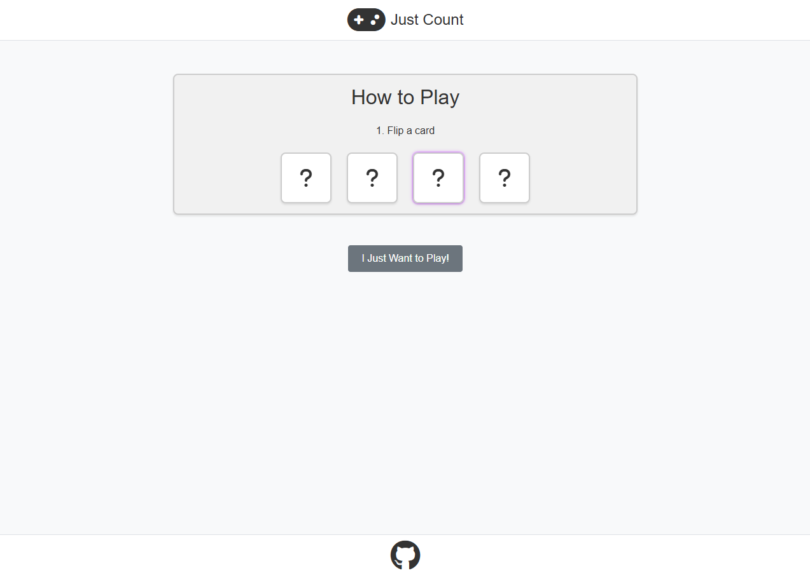
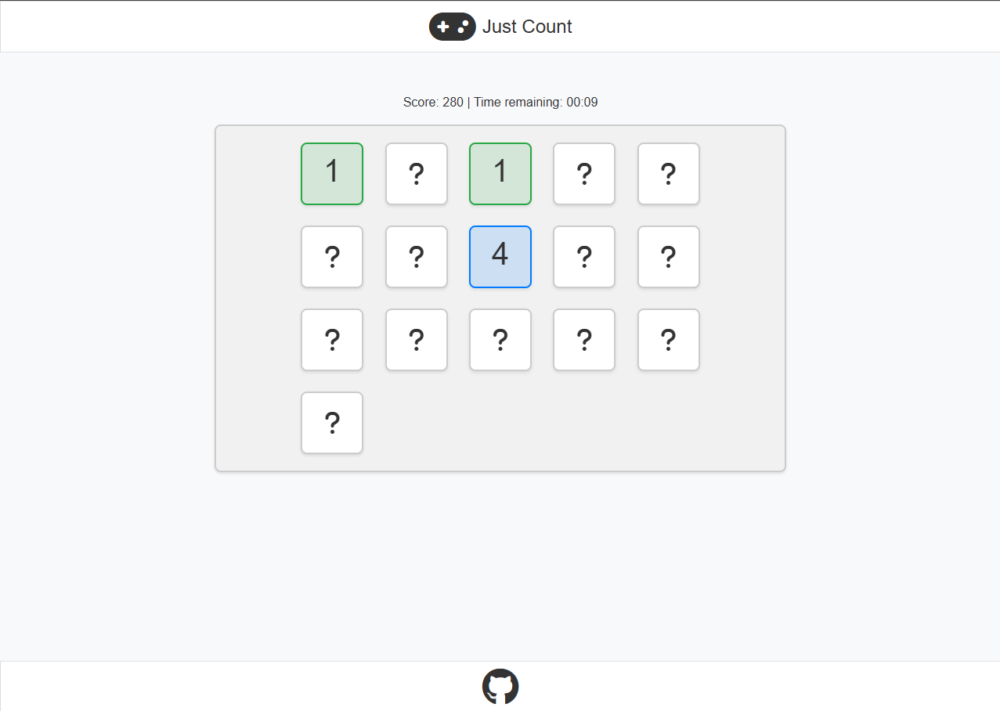

**Tablet:**

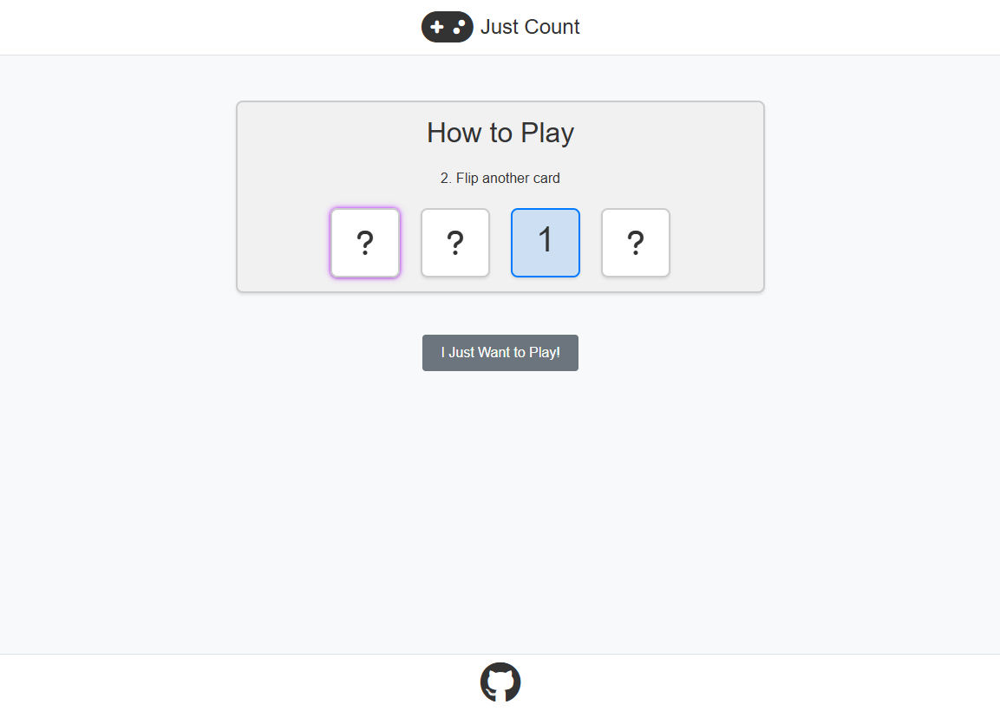
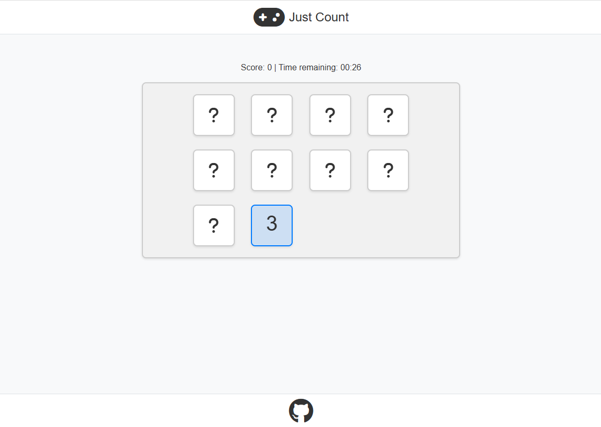

**Mobile:**

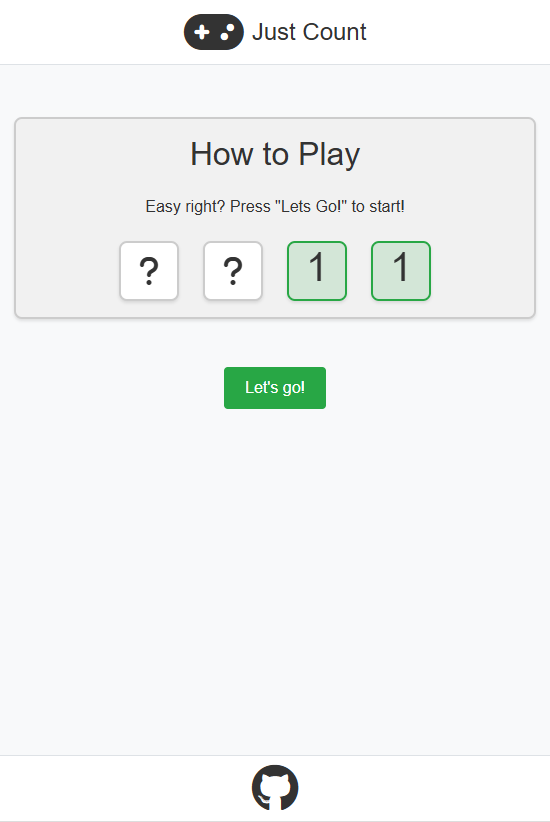
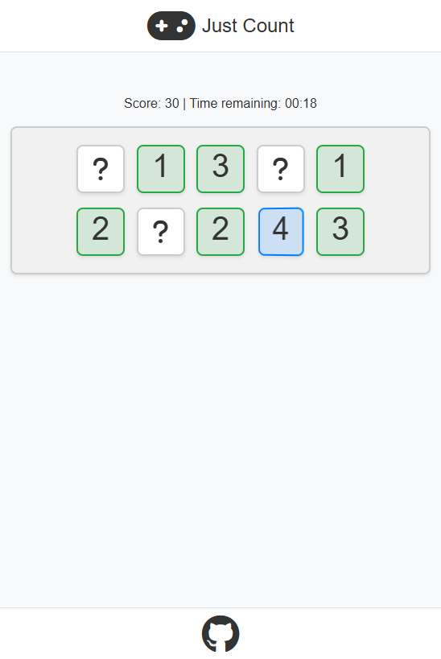

### Automated testing

Automated testing was used for key gameplay functions such as the calculation of cards required per round and that card matches are correctly being checked. As a result, the cards per round calculation was found to be incorrect, the original code and Jest test that discovered this bug can be found in **assets > js > tests > `cards-per-level.test.js`**

The results of the original function were:

```
FAIL  assets/js/tests/cards-per-level.test.js
  Expected card counts per level
    √ Level 1 = 10 cards (3 ms)
    √ Level 2 = 12 cards
    √ Level 3 = 14 cards
    √ Level 4 = 16 cards (1 ms)
    × Level 5 = 18 cards (2 ms)
    × Level 6+ should be 20 cards (1 ms)
```

From this we can see that the function is not correctly calculating the cards required from level 5+.
My original plan was the for 10 cards (5 pairs) on level 1, gaining 1 additional pair of cards up to 10 pairs in play. After this, the amount of pairs should remain at 10 for future rounds to prevent the game becoming more about visible screen spare over 'skill'.

The results showed the below detailed results for the fails:

```
● Expected card counts per level › Level 5 = 18 cards

    expect(received).toBe(expected) // Object.is equality

    Expected: 18
    Received: 40

● Expected card counts per level › Level 6+ should still be 20 cards

    expect(received).toBe(expected) // Object.is equality

    Expected: 20
    Received: 40
```

This shows that the value after level 4 is static at 40 cards. This is incorrect and should only be 20 cards.
Looking at the original code, I can see the mistake is actually commented above the issue, whereby I accidentally changed to cards rather than pairs. So instead of using the base (4) + 6 to equal 10 pairs after level 5, I actually added 16 to equal 20 cards and 10 pairs.

The below code was changed:

```
"if (level < 5)"     to   "if (level <= 5)"
"return base + 16"   to   "return base + 6"
```

This resulted in the following jest results for the updated code:

```
 PASS  assets/js/tests/cards-per-level.test.js
  Expected card counts per level
    √ Level 1 = 10 cards (4 ms)
    √ Level 2 = 12 cards
    √ Level 3 = 14 cards
    √ Level 4 = 16 cards (1 ms)
    √ Level 5 = 18 cards
    √ Level 6+ should still be 20 cards
```

## Running the Automated Tests

The test that resulted in the above bug is still present in the `cards-per-level.test.js` file with the resolution code commented below. To test this yourself, please install node.js using [this link](https://nodejs.org/en/download) and open your local copy of this code.

1. In vscode, with this code open, along the top toolbar select "Terminal" -> "New Terminal"
2. Enter "npm install"
3. Enter "npm install --save-dev jest"
4. Enter "test"

This should output the test results to the terminal window.
To check the corrected code, please comment out the top `getPairsForLevel()` and uncomment the second, then run the tests again.

---

## Validation Results

I have used the below table to log any findings from using validators, the results and resoltuions.

| Tool                              | Status      | Issues Found                                                | Fix Notes                                              |
| --------------------------------- | ----------- | ----------------------------------------------------------- | ------------------------------------------------------ |
| **W3C Markup Validation Service** | Fixed       | Duplicate `ID` attribute used                               | Entire duplicate code found - removed                  |
|                                   | In Progress | Consider using the `h1` element as a top-level heading only | Changed `h1` to `h2`                     |
| **CSS Validator**                 |             | No Errors Found                                             |                                                        |
| **JavaScript Linting (ESLint)**   | Fix         | Unused variable `cols` in `game.js`                         | Removed as this was a remnant from the old grid layout |
|                                   | n/a         | `restartGame()` is unused                                   | This is used via the HTML elements `click` action      |
|                                   | n/a         | `tutorialCardClicked()` is unused                           | This is used via the HTML elements `click` action      |

## Validator Links

| Validator                     | URL                                  |
| ----------------------------- | ------------------------------------ |
| W3C Markup Validation Service | https://validator.w3.org/            |
| W3C CSS Validator             | https://jigsaw.w3.org/css-validator/ |
| ESLint Online Demo            | https://eslint.org/demo              |

---

## Credits

| Site      | Content                                   | URL                                                              |
| --------- | ----------------------------------------- | ---------------------------------------------------------------- |
| W3Schools | Flip card                                 | https://www.w3schools.com/howto/howto_css_flip_card.asp          |
| github    | Ignoring files documentation              | https://docs.github.com/en/get-started/git-basics/ignoring-files |
| github    | .gitignore template for node.js           | https://github.com/github/gitignore/blob/main/Node.gitignore     |
| Jest      | Getting started documentation & templates | https://jestjs.io/docs/getting-started                           |
